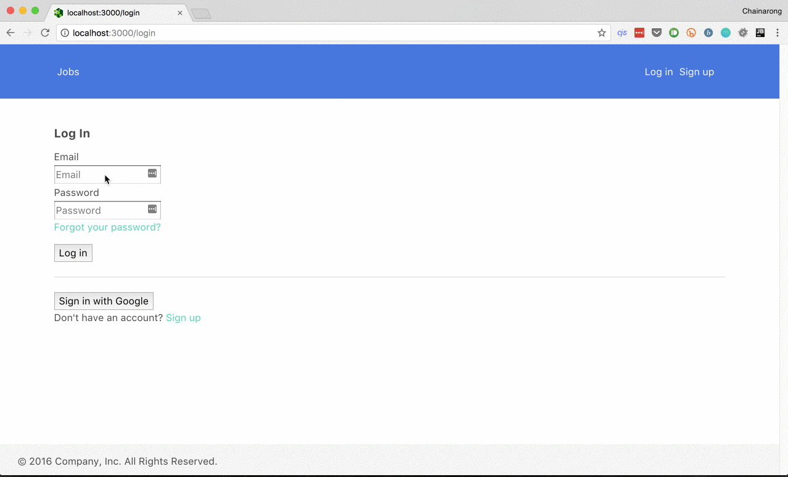

# Simple Time Management

## How to run
1. `git clone` project.
2. `cp .env-example .env`
3. Correct `.env` file for database configuration
4. `$ npm install -g knex`
5. `$ knex migrate:latest`
6. `$ knex seed:run`
7. `npm start`
8. You can now access the website via http://localhost:3000

## How to run with Docker
1. `docker-compose up --build`
2. When finish, run `docker-compose down --rmi local`

## How to run test
1. `cp .env-example .testenv`
2. Correct `.testenv` file for test database configuration
3. `$ npm test`